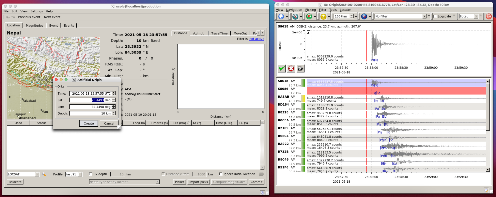

# SeisComP-for-Shakenet
## What
This provides a Docker image to explore Shakenet data (https://shakenet.raspberryshake.org). 



## How
### Dependency
The only dependency is Docker. 

On a Mac you can type in a terminal:
```bash
brew cask install docker
```

Or follow instructions for your computer :
https://docs.docker.com/compose/install/#install-compose

### Get and run 
#### Solution 1: Pull 

To pull the docker image from the cloud, run:

```bash
docker pull fredmassin/seiscomp-for-shakenet:latest
docker run -d --name seiscomp.shakenet -p 9993:22 fredmassin/seiscomp-for-shakenet:latest 
```

#### Solution 2: Build 

To generate the docker image using the Dockerfile, run:

```bash
docker build -t seiscomp:latest -t  seiscomp:4.0.4 -t  seiscomp:4.0.4.debian10 .
docker run -d --name seiscomp.shakenet -p 9993:22 seiscomp.shakenet:latest
```

### Use 

The previous will also start an ssh server that you can connect to with (no password):

```bash
ssh -p 9999 sysop@localhost
```

You can they follow normal SeisComP usage (http://seiscomp.de).
