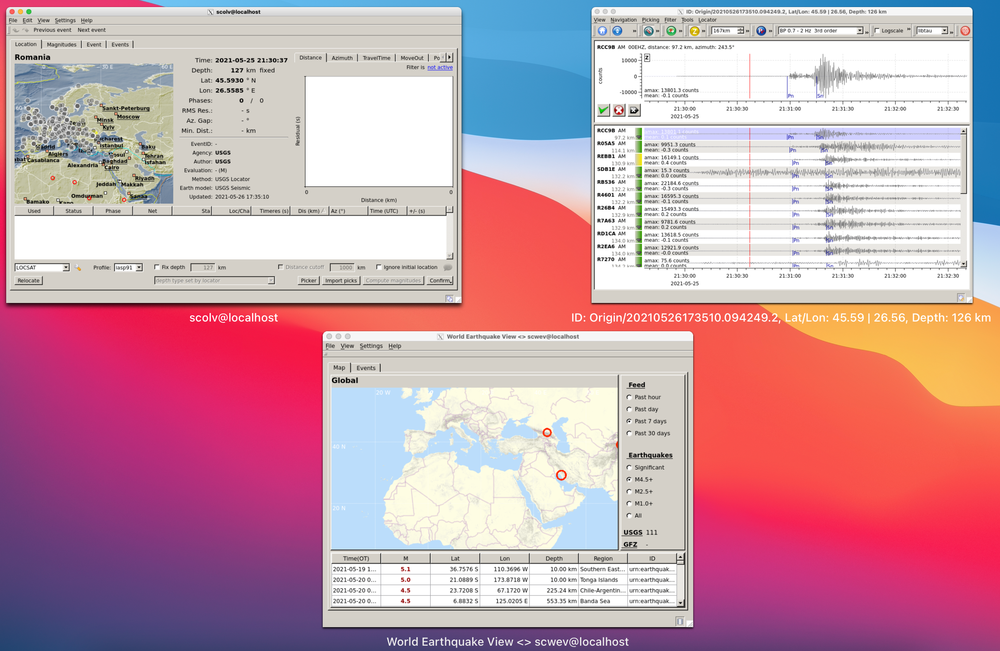

# SeisComP-for-Shakenet
## What
This provides a Docker image to explore Shakenet data (https://shakenet.raspberryshake.org). 



## How
### Dependency
The only dependency is Docker. 

On a Mac you can type in a terminal:
```bash
brew cask install docker
```

Or follow instructions for your computer :
https://docs.docker.com/compose/install/#install-compose

### Get and run 
#### Solution 1: Pull 

To pull the docker image from the cloud, run:

```bash
docker pull fredmassin/seiscomp-for-shakenet:jakarta
docker run -d --name seiscomp.shakenet -p 9876:22 fredmassin/seiscomp-for-shakenet:jakarta 
```

#### Solution 2: Build 

To generate the docker image using the Dockerfile, run:

```bash
git clone https://github.com/FMassin/SeisComP-for-Shakenet.git
docker build -f SeisComP-for-Shakenet/jakarta/Dockerfile -t seiscomp.shakenet:jakarta SeisComP-for-Shakenet/
docker run -d --name seiscomp.shakenet -p 9876:22 seiscomp.shakenet:jakarta
```

### Use 

The previous will also start an ssh server that you can connect to with (no password):

```bash
ssh -p 9876 sysop@localhost
```

For GUIs, once logged in, you need to copy your SeisComP3 license files (3 files, see https://www.seiscomp.de/seiscomp3/license.html) within the container:
```bash
scp -r <user@IP:path to your license files> sysop@localhost:.seiscomp3/
```

You can they follow normal SeisComP3 usage (https://docs.gempa.de/seiscomp3/current/).
